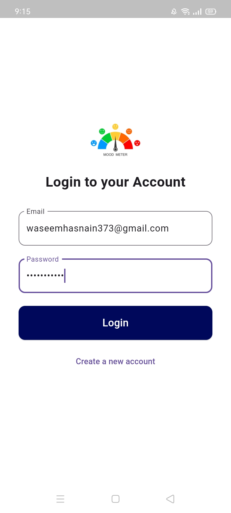
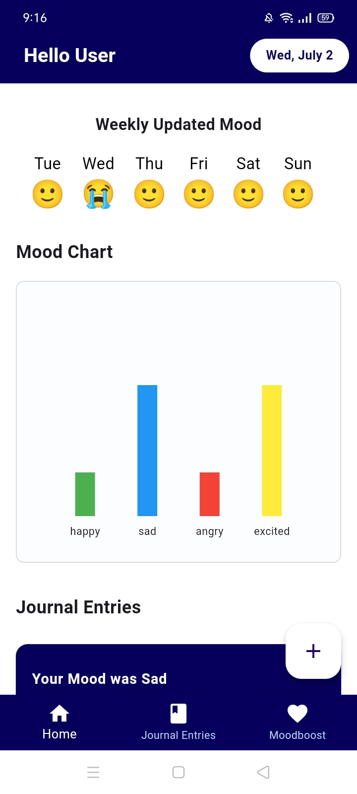
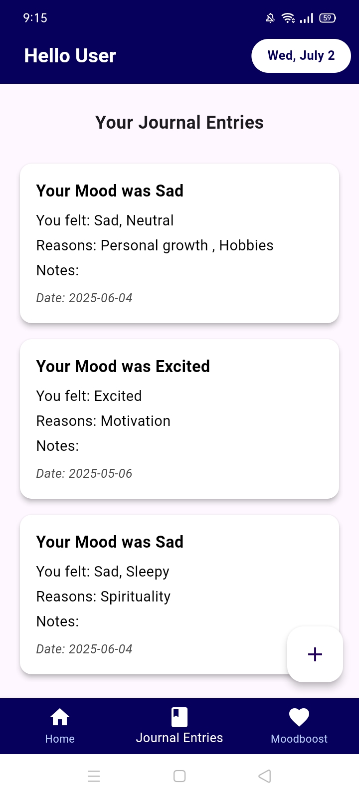
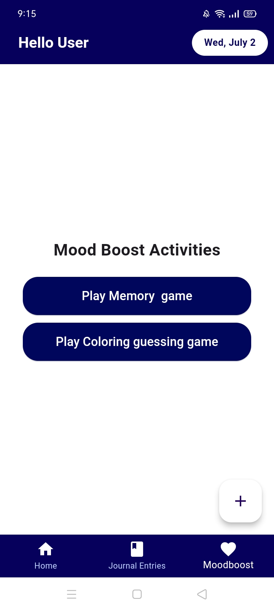
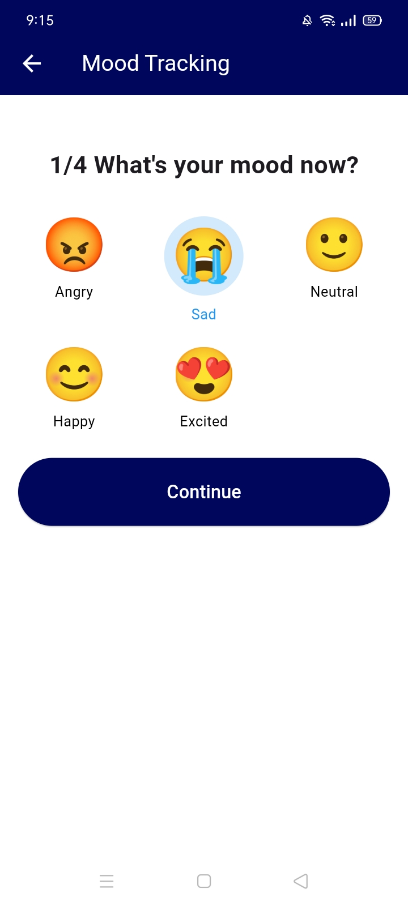
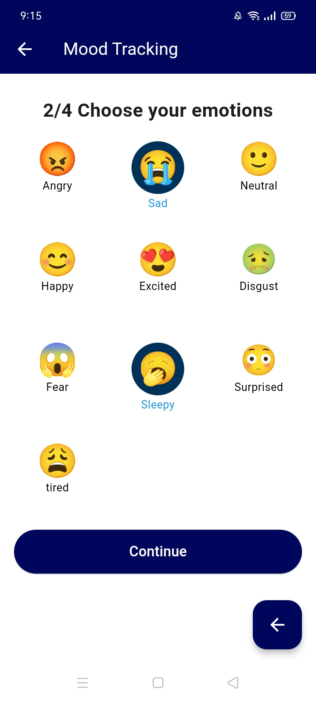
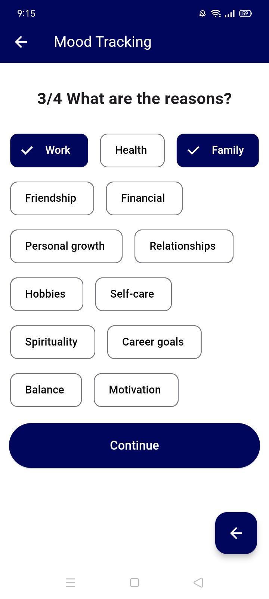

# 🧠 Mood Journal App – A Personal Emotional Tracker

The **Mood Journal App** is a Flutter-based mobile application designed to help users log, reflect on, and understand their emotional health. Built with simplicity and empathy in mind, this app empowers users to track daily moods, identify emotional trends, and develop better self-awareness over time.

---

## 🌟 Features

### 📅 Daily Mood Logging
- Select your mood from predefined emotional categories (e.g., happy, anxious, sad, angry, calm).
- Add a short journal entry to describe what influenced your mood.
- Entries are saved with automatic timestamps.

### 📈 Mood Trend Visualization
- Weekly and monthly charts to monitor your mood trends.
- Identify emotional highs and lows across time.

### 🔔 Personalized Reminders
- Set daily or custom reminders for mood check-ins.
- Helps maintain a consistent journaling habit.

### 🗂️ Emotion History & Filtering
- Scrollable history of mood entries by date.
- Filter entries by mood to explore mood-specific situations.

### 🎨 Calming UI/UX
- Minimal and intuitive design focused on emotional ease.
- Soft color themes and clean layouts.

### 🔐 Local Storage with Optional Cloud Sync
- All data is stored securely using local `SharedPreferences`.
- Optional Firebase integration for cloud backup and multi-device sync.


## 🛠️ Tech Stack

| Layer               | Technology                           |
|--------------------|--------------------------------------|
| **Framework**       | Flutter                              |
| **Language**        | Dart                                 |
| **State Management**| Provider                             |
| **Local Storage**   | SharedPreferences                    |
| **Cloud Backend**   | Firebase Authentication + Firestore |
| **Charts**          | fl_chart / syncfusion_flutter_charts|


---

## 🚀 Getting Started

### 1. Clone the Repository
```bash
git clone https://github.com/HafsaQureshi1/MoodJournal-track-your-emotions.git
cd MoodJournal-track-your-emotions
```
### 2. Install Dependencies
```bash
flutter pub get
```
### 3. Run the App
```bash
flutter run
```

## 📱 Screenshots

<p float="left">
 
  
   
</p>

<p float="left">
  
  
</p>

<p float="left">
  
  
</p>

<p float="left">
  
  
</p>

### 👩‍💻 Author
**Hafsa Waseem**  
Flutter Developer | UI/UX Enthusiast  
Inspired by real-life challenges with patience and emotional regulation.
